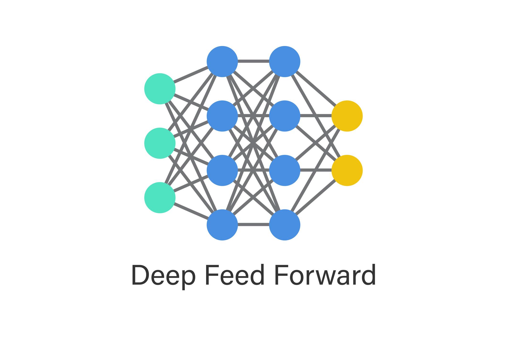
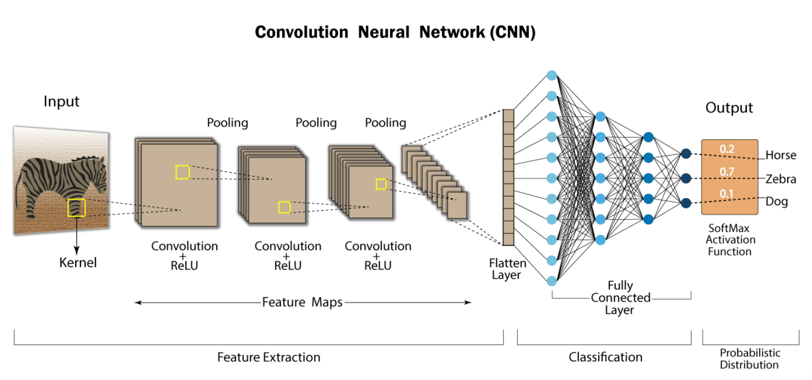

# FNN vs. CNN 概述

## 一、什么是 FNN？

**FNN (Feedforward Neural Network, 前馈神经网络)**  
常见别名：
- Fully Connected Network
- Dense Neural Network
- MLP（Multi-Layer Perceptron）



**特点：**
- 每一层的每个神经元都和下一层所有神经元连接
- 数据从左往右单向传播
- 不存在“局部连接”
- 不共享参数

**数学本质：**

每一层的变换为：

```
y = f(Wx + b)
```
即：矩阵乘法 + 激活函数

---

## 二、什么是 CNN？

**CNN (Convolutional Neural Network, 卷积神经网络)**  
为图像处理设计。



**核心区别：**

|    FNN    |   CNN   |
|:---------:|:-------:|
| 全连接    | 局部连接 |
| 参数多    | 参数少  |
| 不考虑空间结构 | 保留空间结构 |
| 适合[tabular](#一什么是-tabular-数据)数据 | 适合图像 |

**关键结构：**
- Convolution layer（卷积层）
- Kernel / Filter（卷积核）
- Pooling（池化）
- 参数共享

CNN 通过“局部像素相关性”提取空间结构信息。

---

## 三、FNN vs CNN 本质区别

**一句话总结：**

- **FNN** 把图片当成一串数字
- **CNN** 把图片当成有空间结构的数据

举例：一个 28×28 的图片
- FNN 会将其拉平成 784 维向量
- CNN 会保留 28×28 的二维结构

这导致：
- FNN 在图像任务上效果一般
- CNN 在图像任务上表现更优

---

## 四、什么是 Inference（推理/预测）？

机器学习两阶段：
1. **Training（训练）**
   - 用数据
   - 计算 loss
   - 反向传播
   - 更新参数
2. **Inference（推理）**
   - 不更新参数
   - 只前向传播
   - 输出预测结果

比如：
- 用 MNIST 训练模型 → 是 training
- 用模型预测新手写数字 → 是 inference

公式表示：
- Training = forward + backward
- Inference = forward only

**工业实际中：**
- 训练只做一次
- 推理可能做十亿次

---

## 五、什么是 Tabular 数据？

Tabular = 表格型数据（如 Excel）

示例表格：

| age | income | height | gender |
|-----|--------|--------|--------|
| 25  | 50000  | 170    | 0      |
| 30  | 80000  | 180    | 1      |

**特点：**
- 每列为一个特征（feature）
- 每行为一个样本（sample）
- 特征间没有空间关系
- 列与列之间仅有“逻辑关系”，无“位置关系”

**常见场景：**
- 金融风控
- 医疗预测
- 用户流失预测
- 推荐系统特征

---

## 六、什么是图像数据？

图像不是表格，而是有空间结构的二维/三维张量。  
如 28×28 的灰度图：
- 数学表示： $X \in \mathbb{R}^{28 \times 28}$

**关键区别：**
- 每个像素与周围像素强相关
- 上下左右位置有意义
- 平移图片不应改变内容本质

---

## 七、本质区别：结构性

- **Tabular 数据**：特征无序。即使交换 income 和 height 的列顺序，只要权重对应调整，模型不会变。没有“空间邻接”概念。
- **图像数据**：像素有位置关系。随机打乱像素，CNN 的效果会崩溃。图像关键信息在于局部模式和空间结构。

---

## 八、模型选择

### 为什么 FNN 更适合 Tabular？

- FNN 的假设：
  - 各特征独立输入
  - 没有局部关系
  - 不共享参数
- 这与 tabular 数据完全匹配。

### 为什么 CNN 更适合图像？

- CNN 做局部卷积、参数共享，并具有**[平移不变性](https://en.wikipedia.org/wiki/Translational_invariance)**。
- 如边缘检测，一个 filter 可以在图像的任意位置使用。

---

## 九、简要总结

- **Tabular**：特征是抽象属性，无空间含义
- **Image**：特征是像素，空间结构本身就是关键信息

> [回到 Tabular 解释](#一什么是-tabular-数据)
